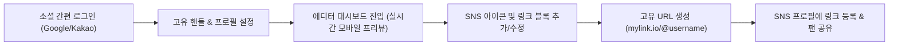
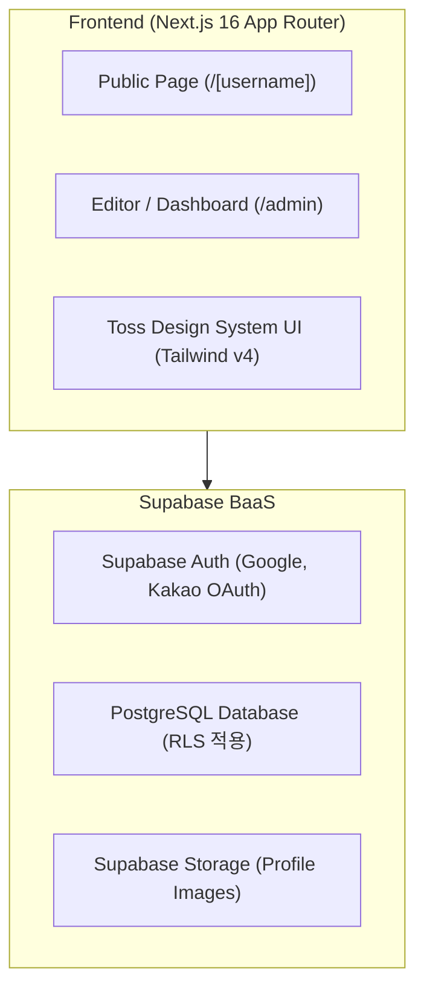

# [PRD] 마이링크 (MyLink) 제품 요구사항 정의서

- **문서 버전**: v1.0 (MVP)
- **작성 일자**: 2026-10-04
- **상태**: 확정 (Approved for MVP)
- **대상 독자**: 제품 기획자, 프론트엔드/백엔드 개발자, 디자이너

---

## 1. 프로젝트 개요 (Project Overview)

### 1.1 배경 및 목적
인스타그램, 틱톡, 유튜브 등 다양한 채널에서 활동하는 크리에이터와 인플루언서는 프로필에 걸 수 있는 링크가 1~2개로 제한되어 있습니다. **"마이링크"**는 크리에이터가 자신의 모든 SNS 채널과 중요 콘텐츠 링크를 하나의 깔끔하고 신뢰감 있는 단일 모바일 최적화 페이지로 통합하여 팬들에게 전달할 수 있도록 돕는 링크트리(Linktree) 클론 서비스입니다.

### 1.2 핵심 타겟 고객
- **주 타겟**: 유튜브, 인스타그램, 틱톡 등에서 활동하는 **크리에이터 및 인플루언서**
- **부가 타겟**: 간편하게 본인의 포트폴리오 및 SNS 채널을 한곳에 모으고 싶은 개인/프리랜서
- **최종 소비자**: 크리에이터의 프로필 링크를 통해 방문하는 **팬 및 구독자(모바일 유입 중심)**

### 1.3 핵심 가치 제안 (Value Proposition)
1. **극도의 단순함과 빠른 세팅**: 3분 안에 소셜 로그인부터 내 고유 링크 완성까지 가능
2. **실시간 모바일 프리뷰 (WYSIWYG)**: 편집하면서 실제 모바일 화면에 어떻게 보일지 즉시 확인
3. **토스 디자인 시스템(TDS) 기반의 신뢰감 있는 UI**: 군더더기 없는 타이포그래피와 모바일 터치 친화적 인터랙션 제공

---

## 2. 사용자 페르소나 및 유저 플로우 (User Flow)

### 2.1 페르소나: "크리에이터 지은 (26세, 패션/일상 유튜버)"
- **목표**: 인스타그램 프로필 바이오에 넣을 링크 하나로 유튜브 최신 영상, 블로그 마켓, 공식 문의 이메일을 모두 깔끔하게 보여주고 싶음.
- **Pain Point**: 기존 툴들은 설정이 복잡하거나 디자인이 조잡함. 모바일에서 제대로 보이는지 일일이 테스트하기 번거로움.

### 2.2 핵심 유저 저니



### 2.3 상세 사용자 시나리오 (User Scenarios)

#### 🎬 시나리오 1: 크리에이터의 첫 페이지 생성 및 온보딩 (3분 완성)
* **상황**: 라이프스타일 유튜버 지은은 인스타그램 바이오에 넣을 통합 링크 페이지를 새로 만들고 싶다.
* **사용자 행동**:
  1. 마이링크 랜딩 페이지에서 `[카카오로 3초 만에 시작하기]` 버튼을 누른다.
  2. 고유 핸들로 `@jieun_daily`를 입력하고 중복 확인을 통과한다.
  3. 프로필 설정에서 본인의 대표 프로필 사진을 등록하고, 닉네임 `지은 JIEUN`, 태그 `크리에이터 · 라이프스타일`, 한 줄 소개를 작성한다.
  4. 인스타그램, 유튜브, 블로그의 공식 SNS 채널 URL을 입력하여 상단 아이콘 바를 활성화한다.
  5. `[+ 링크 추가]`를 눌러 이번 주 업로드한 최신 브이로그 영상 링크와 마켓 링크 2개를 등록한다.
  6. 우측 실시간 모바일 목업 프리뷰에서 스마트폰 화면과 동일하게 렌더링된 결과를 확인한다.
* **시스템 반응**: 
  - 텍스트 입력 및 링크 추가 시 우측 스마트폰 프리뷰 화면에 지연 없이 즉각 반영된다.
  - 저장 완료 시 `https://mylink.io/@jieun_daily` 고유 주소가 생성되고 `[링크 복사]` 토스트 알림이 뜬다.
* **결과**: 지은은 복사한 링크를 인스타그램 프로필 바이오와 유튜브 더보기란에 즉시 붙여넣는다.

---

#### 📱 시나리오 2: 방문자(팬/구독자)의 링크 탐색 및 모바일 경험
* **상황**: 팬 민수는 지은의 인스타그램 스토리를 보다가 프로필 바이오에 걸린 `https://mylink.io/@jieun_daily` 링크를 탭한다.
* **사용자 행동**:
  1. 인스타그램 인앱 브라우저로 지은의 마이링크 페이지에 접속한다.
  2. 1초도 안 되는 빠른 속도로 로딩된 깔끔한 토스 스타일 프로필 페이지를 확인한다.
  3. 상단 SNS 아이콘 바에서 `유튜브 아이콘`을 눌러 최신 채널로 이동하거나, 추천 링크 중 `착장 & 소품 정보 모음 🛍️` 버튼을 탭한다.
  4. 링크 버튼을 누를 때 토스 특유의 쫀득한 탭 애니메이션(Active feedback)을 느끼며 해당 쇼핑몰/마켓 페이지로 부드럽게 새 창 이동한다.
  5. 페이지 우측 상단의 `[공유]` 아이콘을 눌러 같은 지은의 팬인 친구에게 카카오톡으로 프로필 링크를 공유한다.
* **시스템 반응**: 
  - 모바일 세로 비율(Safe-area)에 완벽하게 맞춰 화면 잘림 없이 렌더링된다.
  - 외부 링크 전환 시 악성 스크립트 방지 및 보안 속성(`target="_blank" rel="noopener noreferrer"`)이 안전하게 적용된다.
* **결과**: 방문자는 분산된 채널과 판매 링크를 헤매지 않고 원클릭으로 손쉽게 탐색할 수 있다.

---

#### ⚙️ 시나리오 3: 실시간 콘텐츠 업데이트 및 링크 유지보수
* **상황**: 지은이 새로운 콜라보 할인 이벤트를 시작하여, 기존 링크를 수정하고 새 이벤트 링크를 최상단에 노출하고 싶다.
* **사용자 행동**:
  1. 스마트폰 또는 PC에서 마이링크 관리자(에디터)에 로그인한다.
  2. 지난주 브이로그 링크의 제목을 `[기간한정] 가을맞이 특별 할인 룸투어 🍂`로 수정하고 `EVENT` 배지를 부착한다.
  3. 마감된 지난 마켓 링크는 삭제 버튼(휴지통)을 눌러 깔끔하게 정리한다.
  4. 우측 실시간 프리뷰로 즉시 검토한 후 `[저장]`을 누른다.
* **시스템 반응**:
  - 별도의 사이트 재배포나 캐시 갱신 대기 없이, 공개 페이지(`/@jieun_daily`)에 변경 사항이 즉각 반영된다.
* **결과**: 크리에이터는 개발 지식이나 복잡한 툴 없이도 몇 초 만에 최신 콘텐츠 상태를 유지할 수 있다.

---

### 2.4 메인화면 (방문자 뷰) 와이어프레임

```text
┌─────────────────────────────────────────────────────────────┐
│  [마이링크]                                           [공유] │  ← [1] 상단 앱 바 (GNB)
├─────────────────────────────────────────────────────────────┤
│                                                             │
│  ┌───────────────────────────────────────────────────────┐  │
│  │                        ( O )                          │  │  ← 1:1 원형 프로필 아바타 (76px)
│  │              [ 크리에이터 · 라이프스타일 ]                │  │  ← 카테고리 / 직군 배지
│  │                                                       │  │
│  │                      지은 JIEUN                       │  │  ← 크리에이터 활동명 (Display Name)
│  │                     @jieun_daily                      │  │  ← 고유 핸들 URL (@username)
│  │                                                       │  │
│  │       "일상을 담는 브이로그와 좋아하는 공간,           │  │  ← 한 줄 바이오 (소개글)
│  │        따뜻한 취향을 공유해요 ✨"                     │  │
│  │ ───────────────────────────────────────────────────── │  │
│  │      [인스타]   [유튜브]   [틱톡]   [블로그]   [메일]     │  │  ← [2] 공식 SNS 아이콘 바 (가로 정렬)
│  └───────────────────────────────────────────────────────┘  │
│                                                             │
│  ┌───────────────────────────────────────────────────────┐  │
│  │  추천 링크                                            │  │  ← [3] 추천 링크 리스트 영역
│  │ ───────────────────────────────────────────────────── │  │
│  │  [🎬] 이번 주 브이로그 보러가기                 [NEW]  › │  │  ← 링크 #1 (동영상 콘텐츠)
│  │       가을맞이 인테리어 룸투어 & 카페 브이로그            │  │
│  │ ───────────────────────────────────────────────────── │  │
│  │  [🛍️] 착장 & 소품 정보 모음                   [인기]  › │  │  ← 링크 #2 (쇼핑 / 마켓 링크)
│  │       영상 속 문의 많았던 아이템 링크 정리                │  │
│  │ ───────────────────────────────────────────────────── │  │
│  │  [💬] 팬들과 함께하는 일상 오픈채팅                    › │  │  ← 링크 #3 (커뮤니티 / 소통)
│  │       자유롭게 소통하고 다음 영상 피드백을 나눠요         │  │
│  │ ───────────────────────────────────────────────────── │  │
│  │  [✍️] 공식 네이버 블로그 일기                          › │  │  ← 링크 #4 (텍스트 / 블로그)
│  │       사진과 글로 기록하는 소소한 일상 이야기             │  │
│  └───────────────────────────────────────────────────────┘  │
│                                                             │
│                          마이링크                           │  ← [4] 푸터 (서비스 브랜딩)
│            나만의 링크를 3초 만에 만들어보세요              │
└─────────────────────────────────────────────────────────────┘
```

---

## 3. 기능 요구사항 명세 (Functional Requirements)

### [FR-01] 인증 및 온보딩 (Auth & Onboarding)
| 구분 | 요구사항 상세 | 우선순위 |
| :--- | :--- | :---: |
| **소셜 로그인** | Google OAuth 및 Kakao OAuth 간편 로그인 지원 | P0 |
| **세션 유지** | 로그인 후 세션 유지 및 자동 리다이렉트 (대시보드로 이동) | P0 |
| **고유 핸들 설정** | 회원가입 시 고유 유저네임(영문, 숫자, 밑줄, 3~20자) 설정. 중복 체크 필수 (`/[username]`) | P0 |
| **로그아웃/탈퇴** | 사용자 설정 패널에서 로그아웃 기능 제공 | P1 |

### [FR-02] 프로필 기본 정보 관리
| 구분 | 요구사항 상세 | 우선순위 |
| :--- | :--- | :---: |
| **프로필 이미지** | 1:1 비율 이미지 업로드 및 미리보기 (기본 아바타 제공) | P0 |
| **닉네임 (Display Name)** | 크리에이터 활동명 입력 (최대 30자) | P0 |
| **소개글 (Bio)** | 한 줄 소개 또는 설명 텍스트 입력 (최대 100자) | P0 |

### [FR-03] 공식 SNS 아이콘 바 (Social Icons Bar)
| 구분 | 요구사항 상세 | 우선순위 |
| :--- | :--- | :---: |
| **지원 플랫폼** | Instagram, YouTube, X(Twitter), TikTok, Naver Blog, Email | P0 |
| **아이콘 표시** | 등록된 SNS는 공식 브랜드 아이콘 형태로 프로필 하단에 가로 정렬 배치 | P0 |
| **새 탭 열기** | 아이콘 클릭 시 해당 채널이 새 창(`target="_blank" rel="noopener noreferrer"`)으로 안전하게 오픈 | P0 |

### [FR-04] 링크 블록 관리 (Link Buttons)
| 구분 | 요구사항 상세 | 우선순위 |
| :--- | :--- | :---: |
| **링크 추가** | 링크 제목(Title)과 목적지 URL을 입력하여 새 버튼 생성 | P0 |
| **링크 수정/삭제** | 기존 등록된 링크의 제목 및 URL 즉시 수정, 불필요한 링크 삭제 | P0 |
| **유효성 검사** | `http://` 또는 `https://` 프로토콜을 포함한 올바른 URL 형식 검증 | P0 |
| **노출 순서 정렬** | 등록된 순서대로 리스트 표시 (순서 보장) | P0 |

### [FR-05] 실시간 모바일 프리뷰 편집기 (WYSIWYG Admin)
| 구분 | 요구사항 상세 | 우선순위 |
| :--- | :--- | :---: |
| **스플릿 뷰 레이아웃** | - **좌측/메인**: 프로필 정보, SNS 아이콘, 링크 관리 폼<br>- **우측**: iPhone 프레임 형태의 실시간 모바일 프리뷰 영역 | P0 |
| **실시간 동기화** | 입력 폼에서 텍스트 입력, 이미지 변경, 링크 추가 시 우측 프리뷰에 딜레이 없이 즉시 반영 | P0 |
| **복사 및 바로가기** | 상단에 내 완성된 링크(`mylink.io/@username`) 원클릭 복사 버튼 및 미리보기 새 창 버튼 제공 | P0 |
| **반응형 대응** | 태블릿/모바일 접속 시에는 탭 전환 방식(편집 모드 / 프리뷰 모드)으로 제공 | P1 |

### [FR-06] 공개 링크 페이지 (Public Landing Page)
| 구분 | 요구사항 상세 | 우선순위 |
| :--- | :--- | :---: |
| **고유 URL 라우팅** | `/[username]` 또는 `/@username` 경로로 누구나 접속 가능 | P0 |
| **모바일 최적화 뷰** | 인앱 브라우저(인스타그램, 카톡 등) 뷰포트에 맞춘 100vh Safe-Area 대응 | P0 |
| **인터랙션 피드백** | 링크 버튼 호버 및 탭(Active) 시 토스 스타일의 부드러운 스케일/음영 애니메이션 | P0 |
| **초고속 렌더링** | SSR(Server Side Rendering) 또는 ISR을 통한 초기 로딩 속도 극대화 | P0 |

---

## 4. 비기능적 요구사항 (Non-Functional Requirements)

1. **성능 (Performance)**:
   - 공개 링크 페이지 First Contentful Paint(FCP) < 0.8초, Largest Contentful Paint(LCP) < 1.2초 목표.
   - 불필요한 서드파티 라이브러리를 최소화하고 Next.js 내장 최적화(`next/image`, `next/font`) 적용.
2. **모바일 사용성 (Mobile-First)**:
   - 트래픽의 95% 이상이 스마트폰 인앱 브라우저에서 발생하므로, 모바일 뷰포트(360px~430px) 기준 여백 및 탭 타겟 크기(최소 48px 높이) 보장.
3. **보안 (Security)**:
   - Supabase Row Level Security(RLS)를 적용하여 타인의 링크/프로필 데이터를 변조할 수 없도록 격리.
   - 사용자 입력 URL의 XSS 스크립트 실행 방지(`javascript:` 스킴 차단).

---

## 5. 시스템 아키텍처 및 기술 스택 (Tech Stack)



- **Frontend**: Next.js 16.3 (App Router), React 19, TypeScript
- **Styling**: Tailwind CSS v4, Lucide React (아이콘)
- **Design Concept**: 토스 디자인 시스템(TDS) 스타일 가이드 (단정함, 깔끔한 명도 대비, blue-500 액센트)
- **Backend & Database**: Supabase (PostgreSQL, Supabase Auth, Storage)

---

## 6. 데이터베이스 스키마 설계 (Database Schema)

### 6.1 `profiles` (프로필 기본 정보)
| 컬럼명 | 타입 | 제약 조건 | 설명 |
| :--- | :--- | :--- | :--- |
| `id` | UUID | PK, References `auth.users.id` | 사용자 고유 식별자 |
| `username` | VARCHAR(30) | UNIQUE, NOT NULL | 고유 URL 핸들 (예: `jiwon_daily`) |
| `display_name` | VARCHAR(50) | NOT NULL | 화면 표시용 닉네임 |
| `bio` | TEXT | NULL | 프로필 한 줄 소개 |
| `avatar_url` | TEXT | NULL | 프로필 이미지 URL |
| `created_at` | TIMESTAMPTZ | DEFAULT now() | 생성일시 |
| `updated_at` | TIMESTAMPTZ | DEFAULT now() | 수정일시 |

### 6.2 `social_links` (공식 SNS 아이콘)
| 컬럼명 | 타입 | 제약 조건 | 설명 |
| :--- | :--- | :--- | :--- |
| `id` | UUID | PK, DEFAULT gen_random_uuid() | 고유 식별자 |
| `profile_id` | UUID | FK -> `profiles.id` ON DELETE CASCADE | 프로필 참조 |
| `platform` | VARCHAR(20) | NOT NULL | `instagram`, `youtube`, `twitter`, `tiktok` 등 |
| `url` | TEXT | NOT NULL | 소셜 채널 전체 URL |
| `sort_order` | INT | DEFAULT 0 | 노출 순서 |

### 6.3 `links` (링크 버튼 리스트)
| 컬럼명 | 타입 | 제약 조건 | 설명 |
| :--- | :--- | :--- | :--- |
| `id` | UUID | PK, DEFAULT gen_random_uuid() | 고유 식별자 |
| `profile_id` | UUID | FK -> `profiles.id` ON DELETE CASCADE | 프로필 참조 |
| `title` | VARCHAR(100) | NOT NULL | 버튼에 노출될 링크 텍스트 |
| `url` | TEXT | NOT NULL | 클릭 시 이동할 타겟 URL |
| `sort_order` | INT | DEFAULT 0 | 노출 순서 |
| `is_active` | BOOLEAN | DEFAULT true | 링크 노출 활성화 여부 |
| `created_at` | TIMESTAMPTZ | DEFAULT now() | 생성일시 |

---

## 7. 개발 로드맵 (Milestones)

- **Phase 1 (MVP 구현 - 본 PRD)**
  - Supabase Auth(소셜 간편 로그인) 연동 및 유저 스키마 구축
  - 실시간 모바일 프리뷰가 탑재된 에디터 화면 UI 구현
  - 프로필 수정, SNS 아이콘 바, 링크 추가/삭제 API & 기능 완성
  - 모바일 최적화 공개 페이지(`/[username]`) 렌더링

- **Phase 2 (UX 고도화 & 디자인 확장)**
  - 링크 순서 변경 드래그 앤 드롭 (DnD) 지원
  - 배경색 및 버튼 스타일 프리셋 테마 (다크, 파스텔, 네온 등) 선택 기능
  - 기본 방문자 수 및 링크별 클릭 카운트 통계

- **Phase 3 (수익화 & 콘텐츠 확장)**
  - 유튜브 최신 영상 임베드 플레이어 블록
  - 크리에이터 후원 링크 및 디지털 파일 판매 링크 연동
